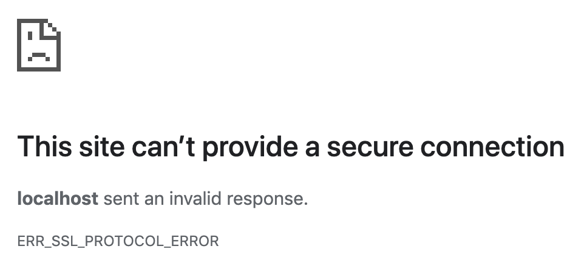

<!-- 
DISCLAIMER:

!!!!

GEBRUIK NIET DIT BESTAND OM HET LABO TE MAKEN MAAR GEBRUIK DE LINK OP DIGITAP!

!!!!
-->

<style>
.holder_default {
    width:500px; 
    height:150px; 
    border: 3px dashed #ccc;
}

.hover { 
    width:400px; 
    height:150px; 
    border: 3px dashed #0c0 !important; 
}

.hidden {
    visibility: hidden;
}

.visible {
    visibility: visible;
}
</style>

<script type="application/javascript" src="https://ajax.googleapis.com/ajax/libs/jquery/2.0.2/jquery.min.js"></script>

<div id="alles">

# HTTPS/SSL

## HTTP/HTTPS
### Wat ga je leren in dit labo?
- Een self signed certificate aanmaken met openssl.
- Testen met Open SSL
### Stappenplan

1. We raden je aan om google chrome te gebruiken voor dit labo. Wens je dat niet te doen zal je voor sommige settings zelf op zoek moeten gaan.

0. Doe een git clone van de volgende repository (of git pull indien je deze repo al hebt)

    ```https://github.com/similonap/software_security_2021.git```

1. Open de terminal in ```labo_https_ssl``` via visual studio code en installeer alle npm dependencies met

    ```
    npm install
    ```

2. We hebben voor deze oefening een webserver in node js geschreven. Je kan deze opstarten met

    ```
    node http.js
    ```

    Merk op dat er een opmerking staat die vermeld:

    ```
    You have not generated a certificate yet. 
    ```

    Dit lossen we zodra op.

3. Open je browser (liefst chrome) op de adressen die in de terminal zijn gegeven. 

    Op http://localhost:3000 zal je een website te zien krijgen die twee links bevat: "Form with GET" en "Form with POST".

    Op https://localhost:3001 krijg je een foutboodschap te zien:

    

    Dit komt omdat we nog geen certificaat hebben aangemaakt voor onze webserver.

4. Sluit de webserver terug af door CTRL-C te drukken in je terminal venster.

5. Om de webserver correct te laten opstarten moeten we met openssl een self signed certificaat maken. Normaal gezien worden certificaten afgeleverd door een certificate authority. Dit is is een organisatie die digitale certificaten aan personen of bedrijven verleent na hun identiteit gecontroleerd te hebben. Dit kost meestal geld dus we gaan natuurlijk in deze cursus dit niet doen. Wij gaan gewoon zelf ons eigen certificaat signen en daar mee werken. 

6. Voer in dezelfde directory als hiervoor het volgende commando uit:

    ```
    openssl genrsa -out key.pem 4096

    openssl req -new -sha256 -out private.csr -key key.pem -config ssl.conf 

    openssl x509 -req -days 3650 -in private.csr -signkey key.pem -out cert.pem -extensions req_ext -extfile ssl.conf
    ```

    Je krijgt hier een aantal vragen met informatie die in het certificaat zullen opgeslagen worden ter identificatie:

    ```
    Country Name (2 letter code) []:BE
    State or Province Name (full name) []:Antwerpen
    Locality Name (eg, city) []:Antwerpen
    Organization Name (eg, company) []:AP
    Organizational Unit Name (eg, section) []:Software Security
    Common Name (eg, fully qualified host name) []:localhost
    ```

    Dit zal twee bestanden aanmaken key.pem en cert.pem. Het eerste bestand is je private sleutel waarmee je je certificaat mee gesigned hebt. En het tweede bestand is het certificaat zelf. 

    **Merk op:** Als je het bestand key.pem opendoet merk je op dat dit heel hard trekt op de private sleutel uit het vorige labo over encryptie.

6. Je kan de inhoud van een certificaat op de volgende manier in textvorm bekijken:

    ```
    openssl x509 -in cert.pem -text
    ```

    Neem een screenshot zodat de ```Subject``` uit de output duidelijk zichtbaar is en sleep deze hieronder in:

    <div id="holder2" style="" class="holder_default">
          
    </div>
    <script>
        $(document).ready(function() {
            addDrop('holder2')
        });
    </script>

7. Als je nu de webserver terug opstart met ```node http.js``` dan zal je niet meer dezelfde fout krijgen bij het opstarten. 

8. Als je nu naar https://localhost:3001 gaat dan krijg je de volgende boodschap te zien: 

    

    Klik op Advanced (Geavanceerd) en dan krijg klapt het open en dan klik je op "Proceed to localhost(unsafe)"

    

    dan krijg je gewoon de website te zien zoals bij de http versie.

    **Opgelet**: als je niet de optie krijgt om verder te gaan. Typ dan ```chrome://flags/#allow-insecure-localhost``` in je browser en zet deze op Enabled. 

4. Waarom waarschuwt je browser je hier over? Waarom is dit onveilig?

    <textarea style="width: 100%;" rows="5">
    </textarea>

4. Laat zien dat deze verbinding niet secure is aan de hand van de adresbalk. 

    Neem hier een screenshot van en sleep deze hieronder in:

    <div id="holder1" style="" class="holder_default">
          
    </div>
    <script>
        $(document).ready(function() {
            addDrop('holder1')
        });
    </script>    

12. Bepaal de SSL/TLS capabilities van jouw browser aan de hand van de website 

    <a href="https://clienttest.ssllabs.com/">https://clienttest.ssllabs.com/</a>

    Voor welke versie(s) van SSL/TLS heeft jouw browser support?

    <textarea style="width: 100%;" rows="3">
    </textarea>

    Waarom zijn lagere versies niet meer supported?

    <textarea style="width: 100%;" rows="5">
    </textarea>

13. Open een tweede terminal venster terwijl je webserver nog opstaat. En run het volgende commando:

    ```
    openssl s_client -connect localhost:3001
    ```

14. Welk TLS protocol ondersteunt onze eigen gemaakte server? (Zie naar de output van vorig commando)

    <textarea style="width: 100%;" rows="2">
    </textarea>

15. Verlaag nu de versie van TLS van onze web server naar TLS 1.0.

    Dit kan gedaan worden door de lijn: 

    ```
    secureProtocol  : 'TLS_method',
    ```

    te vervangen met:

    ```
    secureProtocol  : 'TLSv1_method',
    ```

    te veranderen in `http.js`. Start daarna de web server terug op.

16. Ga naar terug naar de https website en open de chrome developer tools (CTRL-SHIFT-J) en ga vervolgens naar de security tab. Hier kan je allerlei informatie over de security zien van deze pagina.

    Ondersteunt jouw browser deze versie van TLS?

    <textarea style="width: 100%;" rows="2">
    </textarea>

    Vanaf welke versie dan wel?

    <textarea style="width: 100%;" rows="2">
    </textarea>

16. Je kan nu testen of de server specifiek een versie van TLS ondersteunt met het volgende commando:

    ```
    openssl s_client -connect localhost:3001 -tls1_3
    ```

    Neem een screenshot waar de output duidelijk te zien is en sleep deze hieronder in:

    <div id="holder4" style="" class="holder_default">
          
    </div>
    <script>
        $(document).ready(function() {
            addDrop('holder4')
        });
    </script>

17. Zet nu de versie van TLS op 1.2 in de **http.js** file (TLSv1_2_method) en ciphers op TLS_ECDHE_RSA_WITH_AES_128_GCM_SHA256 (of deze key helemaal verwijderen).

16. Zorg ervoor dat het het certificaat in je trusted root certfication authorities van je operating system komt te staan.

    Windows: 
    
    - Open de Microsoft Management Console (Windows key-R en dan mmc intypen)
    - Add remove snap-in
    - Voeg de certificate snap-in toe
    - Kies computer account (Next)
    - Klik op finish
    - Ga naar Trusted Root Certification Authorities/Certificates
    - Klik op Actions -> All Tasks -> Import
    - Importeer jouw cert.pem (altijd next klikken)


    Mac Os: 
    - Dubbelklik op het `cert.pem` bestand
    - Kies keychain 'system'
    - Dubbelklik op 'localhost' die net is toegevoegd
    - Kijk zeker na of het jouw certificaat is!
    - Klik op trust en kies Always Trust bij SSL
    
    Sluit chrome volledig (Chrome menu-->Exit, niet enkel kruisje) en ga terug naar

    ```
    https://localhost:3001
    ```

    en neem een screenshot van je browser die aantoont dat er een slotje staat in de adresbalk:

    <div id="holder3" style="" class="holder_default">
          
    </div>
    <script>
        $(document).ready(function() {
            addDrop('holder3')
        });
    </script>

11. Print deze pagina af als PDF en slaag deze op als `naam_voornaam_labo_https_ssl.pdf`

    Zip alle bestanden die je in dit labo hebt aangemaakt en stuur deze in via digitap. Deze bestanden zijn:
    - naam_voornaam_labo_https_ssl.pdf
    - http.js

<script>
function addDrop(id) {
    var holder = document.getElementById(id);
    holder.ondragover = function () { this.className = 'hover'; return false; };
    holder.ondrop = function (e) {
      this.className = 'hidden';
      e.preventDefault();
      var file = e.dataTransfer.files[0];
      var reader = new FileReader();
      reader.onload = function (event) {
          document.getElementById(id + '_image_droped').className='visible'
          $('#' + id + '_image_droped').attr('src', event.target.result);
      }
      reader.readAsDataURL(file);
    };
}
</script>