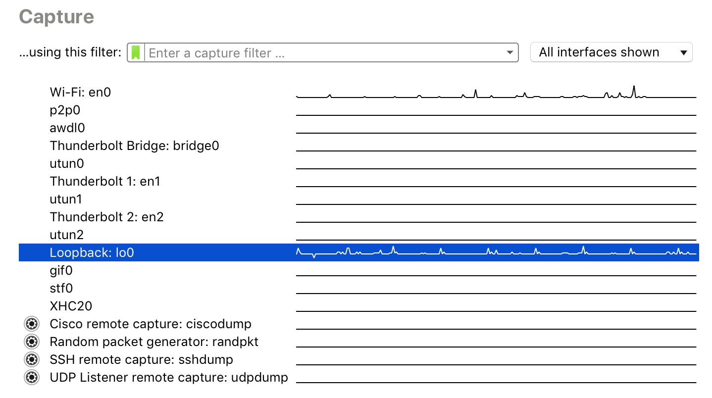
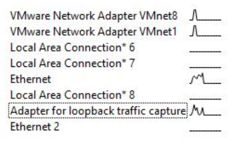
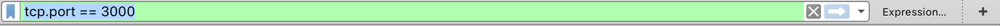
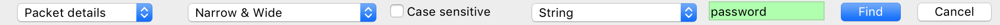
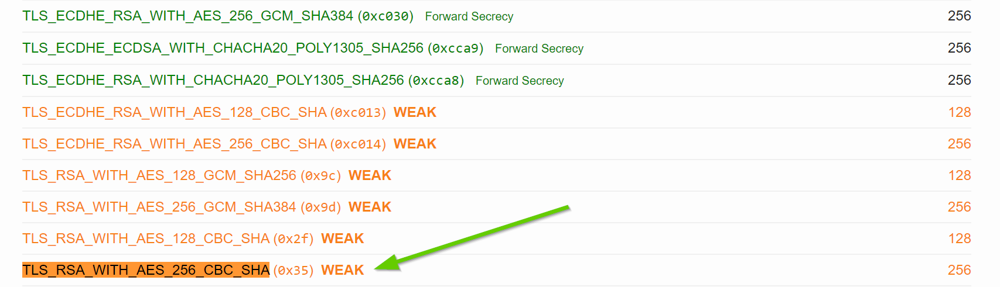
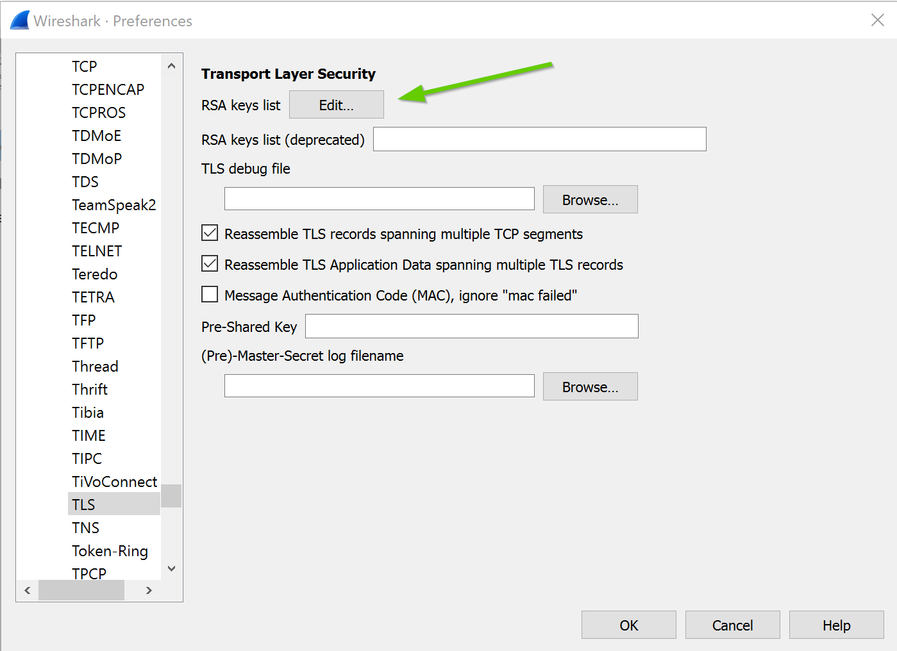
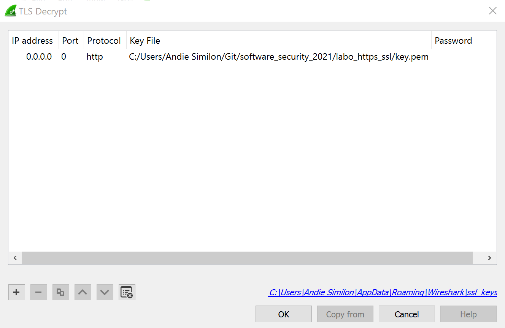

<!-- 
DISCLAIMER:

!!!!

GEBRUIK NIET DIT BESTAND OM HET LABO TE MAKEN MAAR GEBRUIK DE LINK OP DIGITAP!

!!!!
-->

<style>
.holder_default {
    width:500px; 
    height:150px; 
    border: 3px dashed #ccc;
}

.hover { 
    width:400px; 
    height:150px; 
    border: 3px dashed #0c0 !important; 
}

.hidden {
    visibility: hidden;
}

.visible {
    visibility: visible;
}
</style>

<script type="application/javascript" src="https://ajax.googleapis.com/ajax/libs/jquery/2.0.2/jquery.min.js"></script>

<div id="alles">

# HTTPS/SSL 2

## HTTP/HTTPS 2
### Wat ga je leren in dit labo?
- Wireshark installeren en gebruiken.
- Wireshark gebruiken om paketten te sniffen verstuurd via onbeveiligde http.
- Het verschil begrijpen tussen http en https.
### Stappenplan
1. We gaan verder op het vorige labo van https/ssl. Hier hebben we een webserver opgezet met https dat gebruik maakt van een self signed certificate. Zorg ervoor dat alle stappen van het vorige labo zijn uitgevoerd.

2. Pas http.js aan zodat we terug TLS 1.3 gebruiken.

    ```secureProtocol  : 'TLS_method'```

3. Start de webserver op met

    ```node http.js```

4. Open je browser (liefst chrome) op de adressen die in de terminal zijn gegeven. 

    Op http://localhost:3000 zal je een website te zien krijgen die twee links bevat: "Form with GET" en "Form with POST".

    Op https://localhost:3001 krijg je de beveiligde versie van deze website te zien. Als je het labo vorige keer correct hebt uitgevoerd krijg je hier geen errors of warnings meer. 

4. Sluit de webserver terug af door CTRL-C te drukken in je terminal venster.

5. Installeer wireshark: 
https://www.wireshark.org/. Als er gevraagd wordt of je ncap adapter wil installeren doe dit ook anders kan je niet naar je localhost capturen. 

    <iframe src="https://ap.cloud.panopto.eu/Panopto/Pages/Embed.aspx?id=1194de02-db5b-4971-94ea-ab8501537469&autoplay=false&offerviewer=true&showtitle=true&showbrand=false&start=0&interactivity=all" width=420 height=236 style="border: 1px solid #464646;" allowfullscreen allow="autoplay"></iframe>

    <iframe src="https://ap.cloud.panopto.eu/Panopto/Pages/Embed.aspx?id=e6a5cca4-f1ea-4b3c-b98b-ab850151ffa4&autoplay=false&offerviewer=true&showtitle=true&showbrand=false&start=0&interactivity=all" width=420 height=236 style="border: 1px solid #464646;" allowfullscreen allow="autoplay"></iframe>

10. Als alles geïnstalleerd is start je wireshark op. Bekijk eerst het filmpje over filteren in wireshark:

    <iframe src="https://ap.cloud.panopto.eu/Panopto/Pages/Embed.aspx?id=50f56683-e4e5-43d5-8bff-ab870155f73f&autoplay=false&offerviewer=true&showtitle=true&showbrand=false&start=0&interactivity=all" width=420 height=236 style="border: 1px solid #464646;" allowfullscreen allow="autoplay"></iframe>

11. Dubbelklik op de loopback interface:

    

    In windows heet dit "Adapter for loopback traffic capture" (of iets gelijkaardig)

    

    De loopback interface is een "virtuele netwerkkaart". Omdat onze webserver enkel lokaal draait op localhost, gaan we deze interface moeten gebruiken om paketten te onderscheppen tussen onze browser en de webserver.

12. Wireshark maakt het mogelijk om alle netwerk paketten individueel op te vangen en lezen. Vanaf je de loopback interface hebt gekozen zal je direct zien dat er paketten in de lijst komen te staan.

13. Zorg ervoor dat je enkel de paketten te zien krijgt op poort 3000 door in de balk bovenaan: ```tcp.port == 3000``` in te typen.

    

14. Ga naar http://localhost:3000/get en probeer met een login en paswoord in te loggen (willekeurig)

15. Zoek het pakket voor deze GET en zoek achter het paswoord dat je hebt ingegeven. Deze paketten zullen niet altijd direct te vinden zijn, dus wat speurwerk kan nodig zijn. 

    Je kan ook zoeken achter paketten door Find Packet te doen (ctrl-f). 

    

16. Maak een screenshot van het gevonden pakket en sleep deze hier onder in. Zorg ervoor dat het passwoord en login zichtbaar is. 

    <div id="holder" style="" class="holder_default">
          
    </div>
    <script>
        $(document).ready(function() {
            addDrop('holder')
        });
    </script>

17. Waarom kon je dit paswoord gewoon clear text zien?

    <textarea style="width: 100%;" rows="2">
    </textarea>

17. Verander nu de filter in de balk bovenaan zodat je de ssl handshake kan zien. 

18. Ga nu naar https://localhost:3001 en kijk nu een wireshark dat je de paketten te zien krijgt. Neem een screenshot waar duidelijk het `Client Hello` en het `Server Hello` pakket op te zien is (gebruik een pijl). 

    Sleep deze screenshot hier onder in:

    <div id="holder2" style="" class="holder_default">
          
    </div>
    <script>
        $(document).ready(function() {
            addDrop('holder2')
        });
    </script>

19. Open een `Client Hello` pakket door er op te dubbelklikken. Zoek het `transport layer security` deel van het paket en klap dat open. 

    Welke Cipher Suites worden ondersteunt door je browser volgens deze Client Hello?
   
    <textarea style="width: 100%;" rows="15">
    </textarea>

    **Tip:** Je kan dit kopieren door rechter muisknop te klikken en dan Copy all selected tree items te kiezen.

    Wat wordt er bedoeld met deze Cipher Suites en waarom stuurt onze browser deze door met het `Client Hello` bericht:

    <textarea style="width: 100%;" rows="5">
    </textarea>

    Welke versies van TLS ondersteunt je browser (zoek naar Extension: supported_version)

    <textarea style="width: 100%;" rows="5">
    </textarea>

20. Open nu een `Server Hello` pakket door er op te dubbelklikken. Zoek het `transport layer security` deel van het paket en klap dat open. 

    Welke Cipher Suite heeft de server gekozen:

    <textarea style="width: 100%;" rows="2">
    </textarea>

21. Verander nu de filter in de balk bovenaan naar: ```tcp.port == 3001```

19. Ga nu naar https://localhost:3001/get en probeer in te loggen met eender welk login en passwoord.

20. Als je nu gaat zoeken in de paketten die hij gesniffed heeft zal je opmerken dat je deze niet meer vind. Waarom is dit?

    <textarea style="width: 100%;" rows="5">
    </textarea>

21. Jouw browser en de server spreken normaal gezien altijd de meest veilige cipher suite (encryptie algoritme) af tijdens de handshake. We gaan nu bewust een zwakkere kiezen, zodat we deze toch kunnen uitlezen via wireshark.

22. Pas de options aan in http.js zodat ze deze properties bevat:

        ```
        ciphers: 'TLS_RSA_WITH_AES_256_CBC_SHA',
        secureProtocol  : 'TLSv1_method',
        ```

    Als je nog herinnert, volgens de website van ssllabs.com stond TLS_RSA_WITH_AES_256_CBC_SHA gemarkeerd als WEAK:

    

    Het ideale voorbeeld dus!

23. Herstart de http server.

24. Ga terug naar wireshark en ga naar preferences (in Edit). Of druk CTRL-SHIFT-P

25. Ga naar Protocols en daarna TLS. Vervolgens ga je naar `RSA keys list` en druk je op Edit. 

    

    en dan druk je op het + knopje.
27. Daar vul je de volgende waarden in:
    - IP Address: 0.0.0.0
    - Port: 0
    - Protocol: http
    - Key File: *de locatie van je key.pem bestand* 

    

28. Als je nu surft naar https://localhost:3001 en je logt in dan zal je terug in wireshark de paketten kunnen lezen. Dit is omdat de cipher suite die je gebruikt niet veilig is. Als iemand in bezit is van de private sleutel, kan die dus toch alles uitlezen. 

29. Maak een screenshot waarmee je bewijst dat je nu terug je login en paswoord kan zien in wireshark als je inlogt in sleep deze hieronder in: 

    <div id="holder3" style="" class="holder_default">
          
    </div>
    <script>
        $(document).ready(function() {
            addDrop('holder3')
        });
    </script>

30. Als je nu terug een sterkere cipher suite kiest en de TSL versie terug verhoogt naar 1.3 met

    ```
        ciphers: 'TLS_AES_256_GCM_SHA384',
        secureProtocol  : 'TLS_method',
    ```

    dan zal je zien dat je de berichten zelfs niet meer kan lezen met de private key.

11. Print deze pagina af als PDF en slaag deze op als `naam_voornaam_labo_https_ssl.pdf`.

    Stuur deze vervolgens in via digitap!

<script>
function addDrop(id) {
    var holder = document.getElementById(id);
    holder.ondragover = function () { this.className = 'hover'; return false; };
    holder.ondrop = function (e) {
      this.className = 'hidden';
      e.preventDefault();
      var file = e.dataTransfer.files[0];
      var reader = new FileReader();
      reader.onload = function (event) {
          document.getElementById(id + '_image_droped').className='visible'
          $('#' + id + '_image_droped').attr('src', event.target.result);
      }
      reader.readAsDataURL(file);
    };
}
</script>