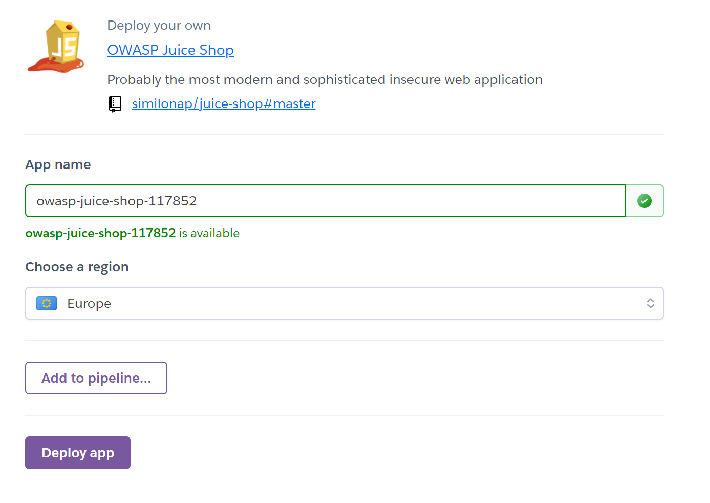
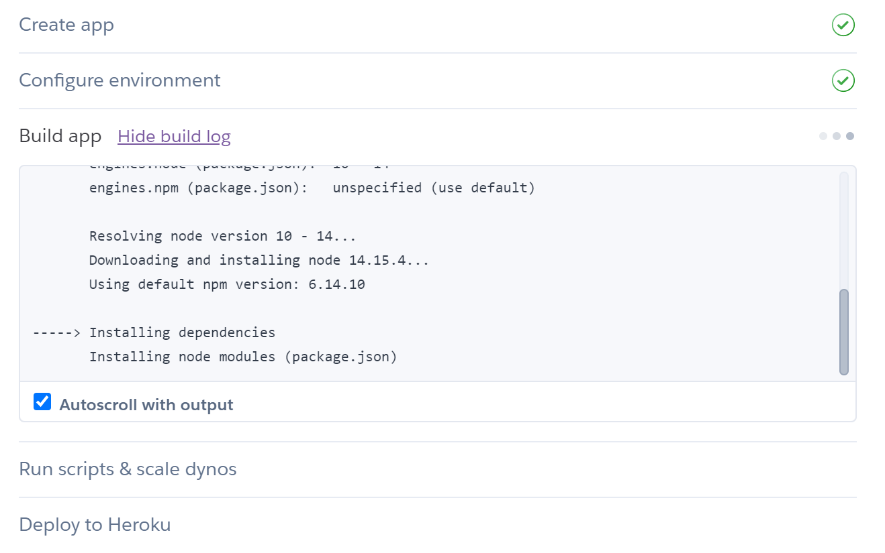
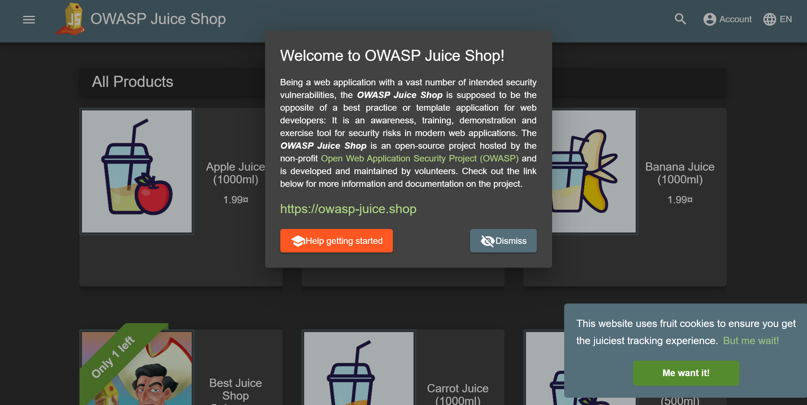

<!-- 
DISCLAIMER:

!!!!

GEBRUIK NIET DIT BESTAND OM HET LABO TE MAKEN MAAR GEBRUIK DE LINK OP DIGITAP!

!!!!
-->

<style>
.holder_default {
    width:500px; 
    height:150px; 
    border: 3px dashed #ccc;
}

.hover { 
    width:400px; 
    height:150px; 
    border: 3px dashed #0c0 !important; 
}

.hidden {
    visibility: hidden;
}

.visible {
    visibility: visible;
}
</style>

<script type="application/javascript" src="https://ajax.googleapis.com/ajax/libs/jquery/2.0.2/jquery.min.js"></script>

<div id="alles">

# Introductie

In deze labo sessie gaan we ons bezig houden met het installeren van een onveilige web applicatie die we bij bepaalde labo's gaan gebruiken. Het is dus de bedoeling dat ieder van jullie een eigen versie van deze web applicatie gaan installeren.

### Wat ga je leren in dit labo?
- Installeren van een web applicatie op heroku
- Onderzoeken van kleine security problemen in deze web applicatie.

### Stappenplan

1. Open je browser en ga naar de volgende website
    
    <a href="https://signup.heroku.com/" target="_blank">https://signup.heroku.com/</a>
    
    en maak een account aan. Indien je al een heroku account hebt mag je deze stap overslaan.

2. Zorg ervoor dat je de volledige registratieproces hebt doorlopen en ingelogd bent in heroku.

3. We gaan nu de web applicatie installeren op heroku. Je kan dit doen door op de onderstaande knop te klikken: 

    <a href="https://dashboard.heroku.com/new?button-url=https%3A%2F%2Fgithub.com%2Fsimilonap%2Fjuice-shop&template=https%3A%2F%2Fgithub.com%2Fsimilonap%2Fjuice-shop" target="_blank"></a>

4. Geef je applicatie een naam met de volgende structuur:

    ```owasp-juice-shop-xxxxxx``` 
    *(vervang xxxxxx met je studentenkaart nummer)*
    
    Zorg er ook voor dat je 'Europe' als region kiest.

    

5. Als je op `Deploy app` klikt dan zal je web applicatie worden gedeployed. Dit kan tot 10-15 minuten duren. Dus wees geduldig en sluit je browser niet af.

    

6. Als de applicatie gedeployed is dan zal je hiervan een melding krijgen in het groen:

    

7. Als de deployment gelukt is kan je de web applicatie aanspreken via:

    ```https://owasp-juice-shop-xxxxxx.herokuapp.com/#/``` 
    *(vervang xxxxxx met je studentenkaart nummer)*

    Je krijgt dan de volgende pagina te zien:

    

8. Je eerste opdracht is op zoek te gaan naar het score bord. Daar kan je jouw vooruitgang volgen. Je moet deze echter zelf proberen te vinden. 
    <details>
    <summary>Eerste tip</summary>
    
    Probeer in je browser naar de pagina bron te kijken.
    
    </details>
    <details>
    <summary>Tweede tip</summary>
    
    Indien je het echt niet vind kan je er ook gewoon naar raden
    
    </details>

9. Op het score bord kan je je vooruitgang volgen. Let op deze vooruitgang wordt gewist als de webserver heropgestart wordt. Dit gebeurd op heroku vrij vaak.

9. Vul hier de url in die je hebt gevonden:

    <textarea style="width: 100%">
    </textarea>

10. Een onoplettende werknemer heeft een directory niet goed beveiligd en iedereen kan zonder problemen aan de bestanden. Deze directory is genaamd 'ftp' en staat dus volledig publiek. Ga hier naartoe.

9. Vul hier de url in die je hebt gevonden:

    <textarea style="width: 100%">
    </textarea>

10. Probeer een aantal files te openen. Waarom kan je sommige files niet openen? 

    <textarea style="width: 100%;" rows="4">
    </textarea>

11. We gaan nu proberen het bestand `package.json.bak` te openen. 

    Dit gaat jammer genoeg niet zomaar.

    Je moet gebruik maken van een `poison null byte` (%2500). Als je dit achteraan de url van het bestand plaatst, gevolgd door een van de bestandstypes die wel werken kan je wel het bestand openen.

    <details>
    <summary>Een tip</summary>
    
    `package.json.bak%2500.md`
    
    </details>   

12. Probeer nu zelf het eastere.gg bestand te openen en kopieer hier de inhoud: 

    <textarea style="width: 100%;" rows="20">
    </textarea>

23. Print deze pagina af als PDF en zend deze via digitap in.

    **Opmerking:** Als dit niet lukt maak dan een zip file en stuur deze door.


<script>
function addDrop(id) {
    var holder = document.getElementById(id);
    holder.ondragover = function () { this.className = 'hover'; return false; };
    holder.ondrop = function (e) {
      this.className = 'hidden';
      e.preventDefault();
      var file = e.dataTransfer.files[0];
      var reader = new FileReader();
      reader.onload = function (event) {
          document.getElementById(id + '_image_droped').className='visible'
          $('#' + id + '_image_droped').attr('src', event.target.result);
      }
      reader.readAsDataURL(file);
    };
}
</script>

